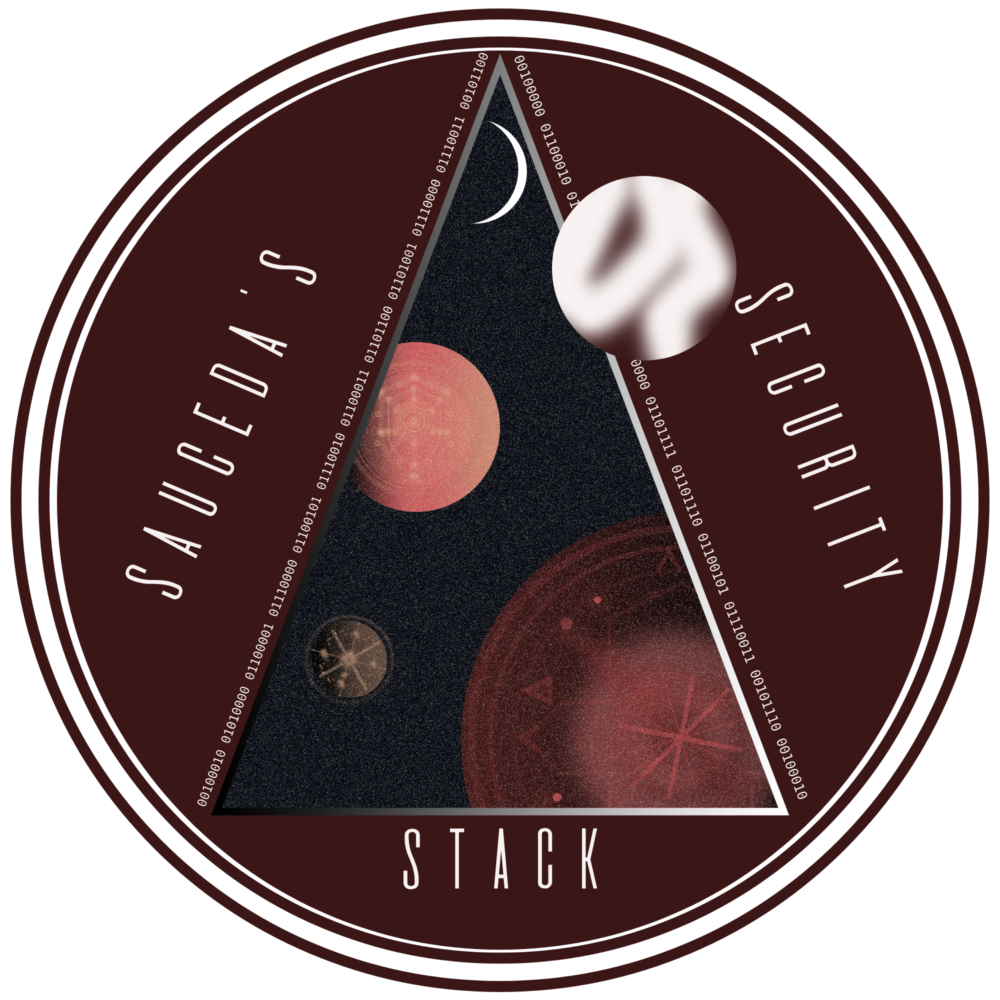

# Sauceda's Security Stack
*is he referring to himself in the third person again?!*  

This repo contains the HTML, CSS, etc used in my website, [saucedasecurity.com](https://saucedasecurity.com).  

Once the page count grew, I migrated the site to a static site generator, Eleventy (11ty), which made it a lot easier to maintain, and I highly recommend it to anyone looking to make their own website! Also, it's not too hard to learn, especially if you're already comfortable with web dev.

## Stack
- **11ty** — static site generator
- **Nunjucks** — templates
- **Markdown** — page content
- **HTML / CSS** — frontend
- **Vanilla JavaScript** — terminal/search functionality
- **Cloudflare Pages / Workers** — deployment and hosting
- **GitHub** — source control and deployment source
